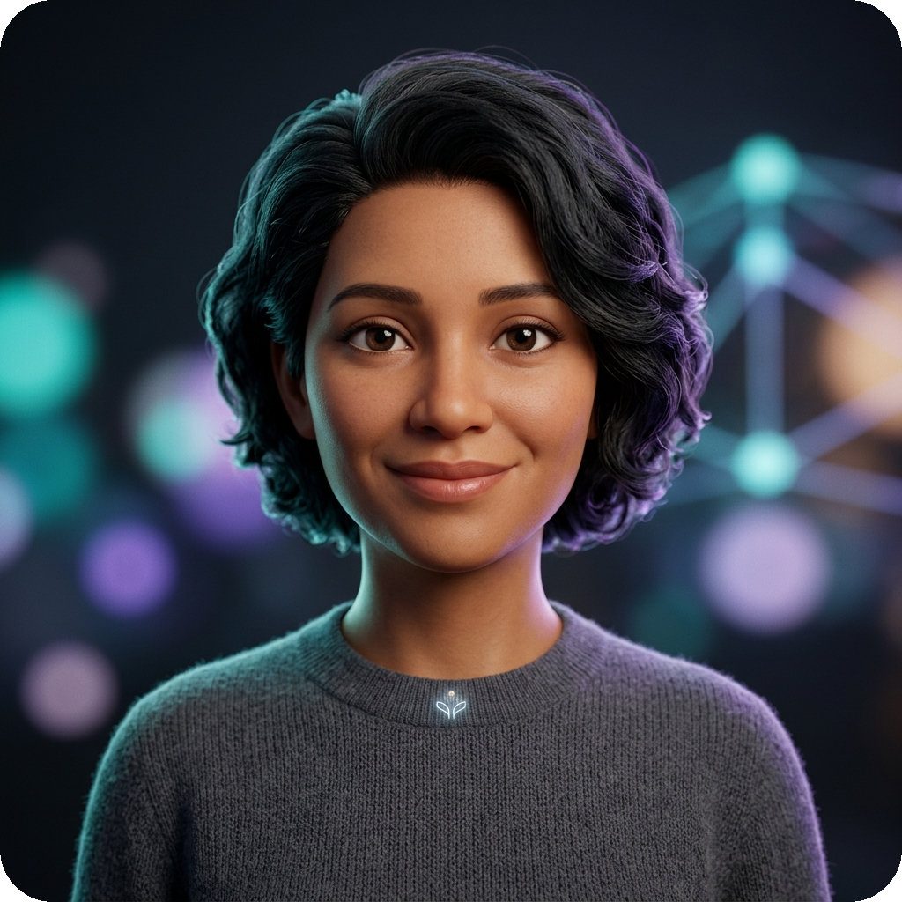
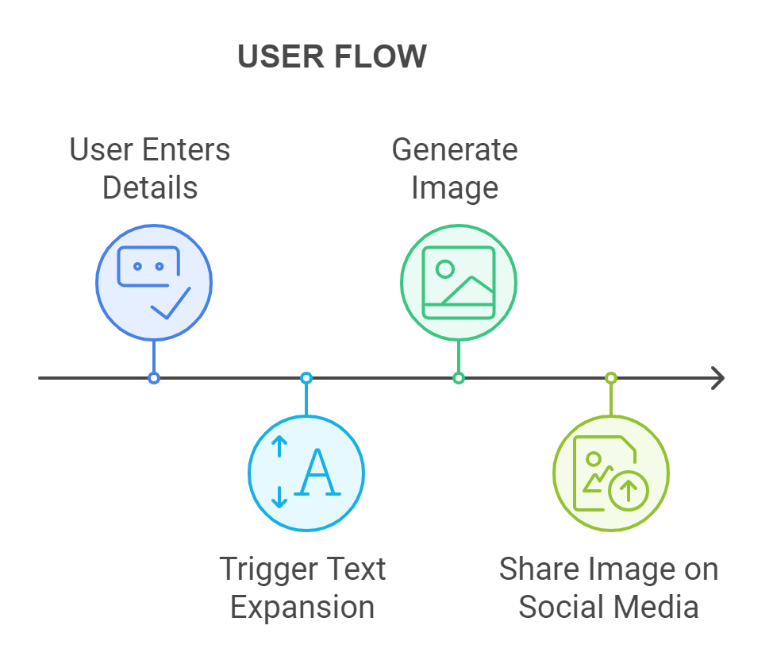
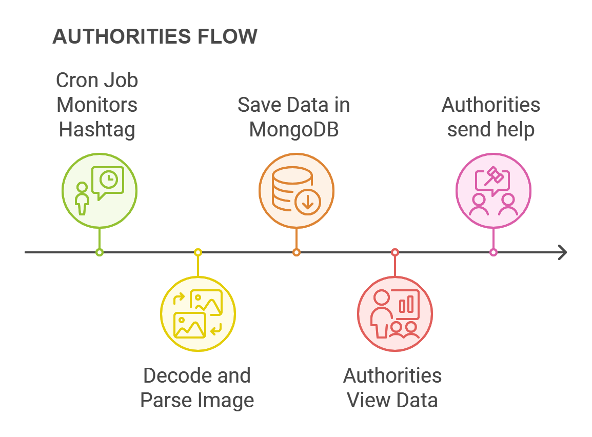
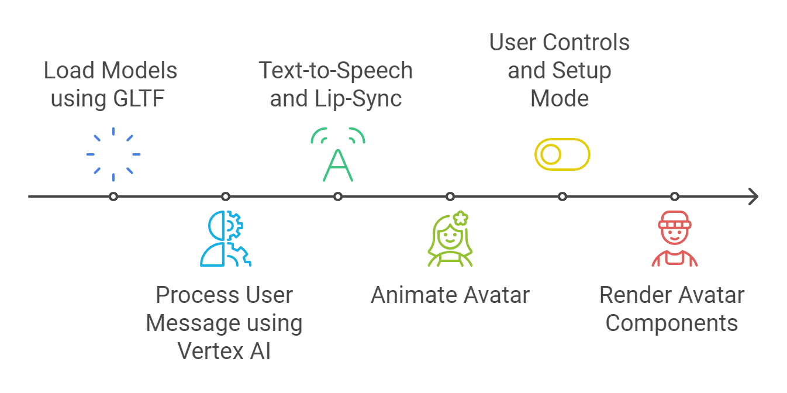
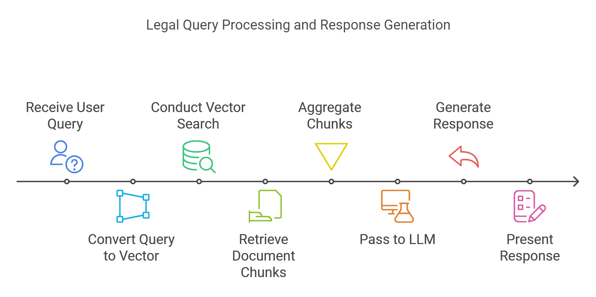
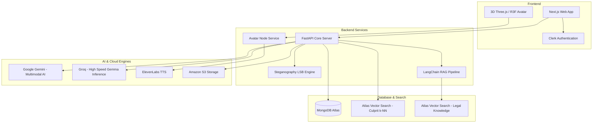

<div align="center">

# 🛡️ SOLACE
### *A Silent Shield, A Strong Voice.*

<br/>



<br/>

**Meet Solace** — *Your 24/7 empathetic, trauma-informed 3D AI companion and confidential guardian.*

<br/>

[](https://nextjs.org/)
[](https://fastapi.tiangolo.com/)
[](https://www.mongodb.com/products/platform/atlas-vector-search)
[](https://ai.google.dev/)
[](https://threejs.org/)

<br/>
<br/>

**SOLACE** is an AI-powered safety, recovery, and legal empowerment platform engineered for women in abusive or high-surveillance environments. It provides covert distress communication, 3D trauma-informed mental health companionship, and constitutional legal guidance—without leaving digital footprints.

---

</div>

## 🌟 The Problem & The Solution

Globally, **1 in 3 women** faces physical or sexual violence. In abusive relationships, abusers frequently monitor phones, messages, and browsing histories—making direct cries for help dangerous. Over **80%** of victims suffer trauma in silence without therapy, and only **14%** have access to formal legal assistance.

**SOLACE** breaks this cycle through three integrated pillars:
1. **Covert SOS Steganography:** Hides distress signals inside benign, AI-generated images so women can seek help in plain sight.
2. **3D AI Mental Health Companion:** Delivers 24/7 empathetic, non-judgmental support with real-time lip-synced 3D facial expressions.
3. **Constitutional Law Agent:** Provides instant, confidential guidance on domestic abuse statutes, custody rights, and restraining orders.

### 🌐 Ecosystem Overview

| Feature | What it does |
| :--- | :--- |
| 🆘 **Discreet SOS** | Creates and communicates emergency messages discreetly |
| 🔐 **Hidden SOS Communication** | Conceals distress information inside ordinary images |
| 🧠 **Gemini Safety Intelligence** | Understands, analyzes, and structures emergency situations |
| 🧑‍⚕️ **AI Support Avatar** | Provides empathetic voice-based emotional support |
| ⚖️ **AI Legal Assistant** | Helps users understand relevant legal and safety information |
| 🔎 **Case & Culprit Intelligence** | Uses embeddings + vector search to identify related cases |

---

## 💡 Core Pillars

### 1. 🖼️ Discreet SOS Messaging via Image Steganography
Enables victims under digital surveillance to transmit distress calls without alerting abusers.

- **AI Prompt Expansion:** Brief, high-stress user inputs (e.g., *"locked in room, scared"*) are expanded into full, context-aware situation reports via Google Gemini.
- **Pixel Steganography:** Distress payloads are imperceptibly embedded into innocent AI-generated images (flowers, landscapes) using LSB encoding.
- **Authority Pipeline:** Reverse steganography extracts messages from monitored hashtags, classifies incident urgency, and alerts authorities.
- **Culprit Similarity Matching:** Offender traits are embedded into vector space and matched against prior records using **MongoDB Atlas Vector Search** ($k$-NN cosine similarity) to identify repeat perpetrators.

| 👤 User Workflow (Covert SOS Creation) | 👮 Authority Workflow (Detection & Response) |
| :---: | :---: |
|  |  |

---

### 2. 🗣️ 3D AI Avatar for Mental Health Support
Provides accessible, confidential, trauma-informed psychological first aid.

- **Interactive 3D Avatar:** Rendered with Three.js and React Three Fiber (`.glb` morph targets) for natural head movement and empathetic facial reactions.
- **Natural Voice & Lip-Sync:** Synthesizes compassionate speech via ElevenLabs TTS synchronized with real-time audio visemes.
- **Trauma-Informed Support:** Personalized coping mechanisms and grounding exercises for panic attacks and emotional distress.
- **Consent-Driven Memory:** Prior session context is securely preserved in MongoDB only when explicitly authorized by the user.

<div align="center">



</div>

---

### 3. ⚖️ Law Bot for Legal Rights & Guidance
Democratizes access to legal rights and protections under the law.

- **Legal RAG Architecture:** Legal statutes, domestic violence acts, and constitutional protections are chunked using LangChain (`RecursiveCharacterTextSplitter`) and indexed into vector collections.
- **Plain-Language Guidance:** Translates complex legal codes into clear, actionable advice on filing complaints, seeking restraining orders, and understanding custody rights.

<div align="center">



</div>

---

## 🏗️ System Architecture



---

## 🤖 MongoDB Atlas Vector Search Implementation

SOLACE relies on Atlas Vector Search to identify suspect profiles across cases and retrieve contextual legal documents:

```python
results_cursor = collection.aggregate([
    {
        "$vectorSearch": {
            "path": "culprit_embedding",
            "index": "culpritIndex",
            "queryVector": description_embedding,
            "numResults": 5,
            "numCandidates": 50,
            "similarity": "cosine",
            "limit": 5,
        }
    },
    {
        "$project": {
            "_id": 1,
            "culprit": 1,
            "score": {"$meta": "vectorSearchScore"}
        }
    }
])
```

---

## 🛠️ Tech Stack

| Domain | Technologies |
| :--- | :--- |
| **Frontend** | Next.js 15, React 19, TypeScript, Tailwind CSS, Lucide Icons, Framer Motion |
| **Backend** | FastAPI, Python 3.12, Uvicorn, Express.js |
| **Database & Vector Search** | MongoDB Atlas, Atlas Vector Search ($k$-NN), PyMongo |
| **Generative AI & LLMs** | Google Gemini (1.5 Flash / Pro), Groq (Gemma) |
| **3D & Conversational Avatar** | Three.js, React Three Fiber, React Three XR, Leva |
| **Voice & Speech Synthesis** | ElevenLabs TTS, Web Speech API |
| **Authentication** | Clerk |
| **Cloud Storage** | Amazon S3 |

---

## 🔒 Security & Privacy

- **Invisible Digital Footprint:** Encoded messages disguise distress signals as normal social media content, evading phone surveillance.
- **Camouflage Mode:** Client-side triggers allow users to instantly camouflage the screen to a neutral interface.
- **Encrypted & Consent-Driven:** Vectorized session memory and case dossiers are encrypted at-rest and retained only with user consent.
